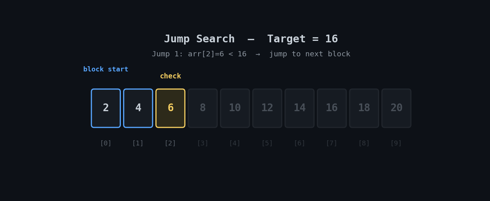

<h1 align="center">🦘 Jump Search</h1>

<p align="center">
  <i>An animated, beginner-friendly walkthrough of the Jump Search algorithm with two Python implementations.</i>
</p>

<p align="center">
  
  
  
</p>

---

## 📽️ Visual Walkthrough

Jump Search works in two phases: it **jumps ahead in fixed-size blocks** to quickly find which block the target could be in, then does a **linear scan inside just that block**.

<p align="center">
  
</p>

> 🔵 Blue = block boundary being tested / active block · 🟡 Amber = element currently checked · 🟢 Green = found

---

## ⚙️ How It Works

1. Pick a block size, typically `step = √n`.
2. Jump forward by `step` each time, checking the **last element of each block**, until you find a block whose last element is `≥ target` (or you run off the end → not found).
3. Once the right block is found, run a **plain linear search** on just that block.
4. Return the index if found, otherwise `-1`.

> ⚠️ Requires **sorted** data, like Binary and Ternary Search.

---

## ⏱️ Complexity

| Case | Time | Space |
|---|---|---|
| Best | `O(1)` | `O(1)` |
| Average / Worst | `O(√n)` | `O(1)` |

Jump Search sits between Linear (`O(n)`) and Binary Search (`O(log n)`) — useful when jumping backward is expensive (e.g. slow storage), since it moves strictly forward unlike Binary Search.

---

## 🐍 Implementation

**Function-based:**
```python
import math

def jump_search(arr, target):
    n = len(arr)
    step = int(math.sqrt(n))
    prev = 0

    while prev < n and arr[min(step, n) - 1] < target:
        prev = step
        step += int(math.sqrt(n))
        if prev >= n:
            return -1

    while prev < min(step, n):
        if arr[prev] == target:
            return prev
        prev += 1

    return -1

arr = [2, 4, 6, 8, 10, 12, 14, 16, 18, 20]
jump_search(arr, 16)
```

**Object-oriented:**
```python
import math

class JumpSearch:
    def __init__(self, arr):
        self.arr = arr
        self.n = len(arr)

    def search(self, target):
        step = int(math.sqrt(self.n))
        prev = 0

        while prev < self.n and self.arr[min(step, self.n) - 1] < target:
            prev = step
            step += int(math.sqrt(self.n))
            if prev >= self.n:
                return -1

        while prev < min(step, self.n):
            if self.arr[prev] == target:
                return prev
            prev += 1

        return -1
```

> 💡 Full file: [`jump_search.py`](./jump_search.py)

---

## ▶️ Run It

```bash
git clone https://github.com/zain-cs/4-Jump-Search.git
cd 4-Jump-Search
python jump_search.py
```

---

## 🔁 Where Jump Search Fits

| | Linear Search | Jump Search | Binary Search |
|---|---|---|---|
| Time complexity | `O(n)` | `O(√n)` | `O(log n)` |
| Movement | Forward only, 1 step | Forward only, block jumps | Jumps back and forth |
| Good for | Small/unsorted lists | Forward-only access (e.g. slow disks) | Random-access sorted data |

---

## 🗺️ Part of a DSA Series

📌 [Linear Search](https://github.com/zain-cs/1-Linear-Search) → [Binary Search](https://github.com/zain-cs/2-Binary-Search) → [Ternary Search](https://github.com/zain-cs/3-Ternary-Search) → **Jump Search** → more to come as I work through DSA.

---

<p align="center">
  Made with 🐍 by <a href="https://github.com/zain-cs">Muhammad Zain Ul Abidin</a>
</p>
